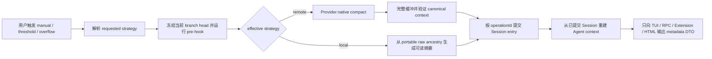

# Pi 原生远端上下文压缩产品拆分

## 计划元数据

- 计划 ID：SCOPE-REMOTE-COMPACTION-001
- 类型：product-scope
- 修订版本：1
- 状态：active
- 创建基线：Pi `4441404640870b8deaac57ea4072b11c512944ce`；Codex CLI `2b5bdcf67547860f2e5c5a605009a70026796b2b`

## 总体方案

- 目标：让 Pi 在使用 OpenAI Responses 或 ChatGPT Codex Provider 时，可以选择由 Provider 生成并回放 opaque compaction context，同时保留现有可读的 local summary compaction。
- 核心结果：用户可以手动或自动执行远端压缩，继续当前会话并恢复已保存会话；不兼容的 Model、Endpoint 或 Credential 不会收到旧的 opaque context；用户始终可以从 append-only 原始分支恢复为可移植的 local summary。
- 默认行为：`compaction.strategy` 初始仍为 `local`。真实 Provider 纵向测试完成前，`remote` 与 `auto` 只标记为 `fixture-verified experimental`，不默认启用。
- 范围：`pi-ai` Provider capability、OpenAI/Codex Adapter、`pi-agent-core` context state、`pi-coding-agent` Session/Compaction/Settings/TUI/RPC/Extension/HTML，以及离线测试与中文文档。
- 不包含：不解密或展示 `encrypted_content`；不为 Anthropic、Google 等 Provider 伪造远端压缩；不修改 Codex Desktop 配置；不改变普通响应的默认 Transport；不删除原始 Session ancestry；本计划阶段不安装本地 Pi，也不调用真实 OpenAI 服务。

## 参与者与核心状态

| 参与者 | 责任 |
|---|---|
| Pi 用户 | 选择 `local`、`remote` 或 `auto`，手动触发压缩，恢复或切换会话 |
| AgentSession | 串行化一次压缩 Attempt，冻结分支，执行 Hook，决定策略，提交 Session，并恢复内存状态 |
| ModelRuntime / Provider | 解析真实认证与 Endpoint，声明 `compact` 与 `canConsumeProviderContext` capability |
| OpenAI/Codex Adapter | 生成请求、收集并验证 opaque canonical context，回放前再次校验 Binding |
| SessionManager | 保存 append-only 原始 ancestry 和独立 `remote_compaction` Entry，构建当前或 portable context |
| TUI / RPC / Extension / HTML | 只消费允许公开的 Compaction metadata，不传播 opaque payload |

压缩状态必须区分：

- 配置策略：`local | remote | auto`。
- 请求策略：本次命令或自动触发实际请求的策略。
- 有效策略：Hook 与 fallback 处理后真正执行的 `local | remote`。
- Native protocol：`openai-responses-compact`、`openai-codex-remote-v2` 或 `openai-codex-compact-legacy`。
- Provider context Binding：精确的 Provider、API、Model、解析后 Endpoint、Format、Protocol 和匿名 Credential Scope。
- Attempt 状态：Operation ID、原因、冻结的 Branch Head、阶段、Fallback Code 和是否已越过 Commit Point。

## 已确认的架构依据

### Pi 当前行为

- `packages/ai/src/types.ts` 的 `Message` 只有 User、Assistant 与 ToolResult；`Context` 只有 System Prompt、Messages 与 Tools。Opaque provider data 不应扩展普通 Message union。
- `packages/ai/src/models.ts` 的 Provider 与 Models 已承担认证后 Dispatch，适合增加可选 capability；`packages/ai/src/api/lazy.ts` 当前只代理 `stream/streamSimple`。
- `packages/ai/src/api/openai-responses-shared.ts` 统一负责 Responses Input 转换；当前 Stream Processor 不处理 Compaction Item。
- `packages/ai/src/api/openai-codex-responses.ts` 已实现 ChatGPT Codex `/codex/responses`、OAuth Account Header、SSE/WebSocket、Retry 与 Zstd；原生压缩必须复用其有效 Endpoint 和认证语义，但压缩请求首版固定使用 SSE。
- `packages/agent/src/agent-loop.ts` 当前只把 System Prompt、Messages、Tools 送入 `Context`；Agent State 需要独立保存 Provider Context。
- `packages/coding-agent/src/core/session-manager.ts` 的 JSONL 是 append-only tree，未知 Entry 在运行时可以进入索引；当前 Session Version 为 3。
- `packages/coding-agent/src/core/agent-session.ts` 已有 manual、threshold、overflow、queue、retry、Hook 与 model switch 接缝，但 manual 与 auto 流程存在重复，需要共享同一个 Attempt FSM。

### Codex CLI 当前行为

- `RemoteCompactionV2` 在目标 Codex 基线中是 Stable 且默认启用。
- V2 继续调用普通 `/responses`，在 Input 末尾加入 `{"type":"compaction_trigger"}`，并发送 `x-codex-beta-features: remote_compaction_v2`。
- V2 必须等到 Terminal Completed，并要求 Output 中恰好一个 `compaction` Item；当前 Transport Retry Budget 为 2。
- Codex 客户端保留最近 User/Developer/System Message，默认最多 64k Token，再追加 Compaction Item。
- Legacy 路径调用 `/responses/compact`；OpenAI Public API 也提供 `responses.compact()`，返回的 canonical Output 应原样回放。

### 参考资料

- Codex 源码基线：`F:\workspace\projects\codex`，Commit `2b5bdcf67547860f2e5c5a605009a70026796b2b`。
- OpenAI 官方 Compaction 指南：https://developers.openai.com/api/docs/guides/compaction
- 当前 OpenAI SDK：`openai@6.26.0`，已确认包含 `responses.compact()`、`CompactedResponse` 与 Compaction Item 类型。

## 全局业务不变量

1. Opaque payload 只允许出现在 Session JSONL 和满足精确 Binding 的 Provider Request 中；不得进入普通 Message、TUI、RPC、Extension Event、HTML Export 或普通 Error/Log。
2. Provider Context 必须绑定精确 Provider、API、Model、Resolved Endpoint、Format Version、Producer Protocol 与 Credential Scope。API Key 使用完整 Key 的 SHA-256；ChatGPT OAuth 使用稳定 `chatgpt_account_id` 与 Credential Source 的 SHA-256，不使用短期 Access Token。
3. Adapter 必须完整缓冲并验证 Remote Result 后才把结果交给 Session。SSE 提前结束、零个或多个 Compaction Item、Malformed Canonical Output、Abort 或 Capacity Failure 均不得提交。
4. 一次 AgentSession 同时最多一个 Compaction Attempt。Attempt 冻结 Branch Head；进入 Append Phase 后不得再 Fallback 或重发。
5. Session Append 是唯一 Commit Point。每个 Attempt 预生成 `operationId` 与 Entry ID；Append 抛错时必须 Reload 并按 Operation ID 判断是否已经提交，禁止盲目重试。
6. `buildPortableRawContext` 只遍历当前 Leaf 的 Ancestors，只包含原始语义 Entry；排除所有 Local/Remote Compaction、Provider Context、Trigger、管理 Entry 和指定的 Overflow Error Entry，不遍历 Sibling。
7. 显式 `remote` 永不降级到 Local；其 Pre-hook 只允许 Cancel，返回 Custom Compaction 必须报错。`local` 与 `auto` 可以接受 Extension Custom Local Result。
8. `auto` 每 Attempt 最多发起一次 Native Compact 和一次 Local Fallback。Abort、Stale Branch 或进入 Append Phase 后不 Fallback。
9. Overflow Error 保留在原始审计 ancestry 中，但不进入 Remote/Portable Compaction Input；提交成功后只重试原 Pending Turn 一次，并阻止递归 Auto Compaction。
10. 新 Session Entry 不删除或改写原始消息。旧 v1-v3 Local Compaction 继续可读；旧版读取兼容必须在写入 v4 前由 Fixture 探针证明。
11. 所有生产代码和测试代码遵守根 `AGENTS.md` 的中文注释要求；不得使用 `any`、行内 Import 或未经检查的第三方类型。

## 原始需求覆盖关系

| 原始目标或约束 | 覆盖单元 |
|---|---|
| 使用 Codex 当前远端压缩能力 | UNIT-01 |
| 保留 Pi Local Compaction 并可选策略 | UNIT-02 |
| Threshold 与 Overflow 自动执行 | UNIT-03 |
| Provider/Model/Endpoint/Credential 不兼容时不丢上下文 | UNIT-04 |
| Resume、Fork、Clone 与恢复 | UNIT-01、UNIT-04 |
| Hook、RPC、TUI、HTML 可观察且不泄露 Payload | UNIT-05 |
| 供较低能力模型直接开发 | 对应 `ATOMIC-REMOTE-COMPACTION-001` 全部原子卡 |
| 真实服务测试需再次说明并确认 | UNIT-05 的 R1 Gate |

## 交付顺序

1. UNIT-01：手动远端压缩并在同一 Binding 下继续与恢复。
2. UNIT-02：用户选择并持久化 Compaction Strategy。
3. UNIT-03：Threshold 与 Overflow 自动执行所选 Strategy。
4. UNIT-04：不兼容 Binding 的阻止与 Portable Local Recovery。
5. UNIT-05：完整可观察性、中文文档与真实用途验收门。

## 交付单元卡

### UNIT-01 手动远端压缩并继续与恢复

- 状态：in_progress
- 用户或业务价值：用户可显式执行 `/compact --remote`，减少长会话上下文，同时继续当前会话或在相同 Binding 下恢复会话。
- 参与者：Pi 用户、AgentSession、ModelRuntime、OpenAI/Codex Adapter、SessionManager。
- 触发与前置条件：已选择受支持的 OpenAI Responses 或 OpenAI Codex Model；Provider 可解析稳定 Credential Subject；当前 Session 有可压缩内容；没有其他 Compaction Attempt。
- 预期结果：Provider 返回并通过验证的 canonical context 被保存为独立 Remote Entry；后续 Prompt 回放同一 Context；关闭并 Resume 后行为一致。
- 验收场景：
  - OpenAI Public `responses.compact()` Fixture 成功，下一请求 Input 包含 canonical Output 和新 User Message。
  - Codex V2 Fixture 验证 Trigger、Beta Header、唯一 Compaction Item、Retention 与最多 2 次 Stream Retry。
  - 明确的 V2 Unsupported Fixture 才尝试 Legacy；Auth、Rate Limit、Model Not Found、Network 或 Protocol Error 不尝试 Legacy。
  - Abort、Malformed Output、0/2 Compaction Items、Capacity Failure 或 Stale Branch 不新增 Entry、不替换 Agent Context。
  - Same-binding Resume 后继续；OAuth Token Refresh 但 Account Subject 不变时允许回放。
- 来源需求或验收条件：用户希望将 Pi 改为 Codex 的压缩能力，并要求先探索和形成可实施方案。
- 明确不包含：策略设置 UI、自动 Threshold/Overflow、跨 Binding 转换、真实 Provider 调用。
- 依赖：无；但实现前必须通过旧读取器兼容探针、External DTO Privacy Gate 与 Binding Guard。
- 风险或假设：ChatGPT Backend Protocol 未公开承诺；真实服务未测前只能声明 Fixture Verified。

### UNIT-02 用户选择并持久化压缩策略

- 状态：pending
- 用户或业务价值：用户可以明确选择继续使用 Local、强制 Remote，或让 Pi 自动选择，并在重启后保留选择。
- 参与者：Pi 用户、SettingsManager、TUI Settings Selector、RPC Client。
- 触发与前置条件：UNIT-01 已完成；Settings 文件可写或 RPC Session 可用。
- 预期结果：`compaction.strategy` 接受 `local | remote | auto`，缺省为 `local`；TUI 和最小 RPC 接口显示并更新当前值。
- 验收场景：
  - 旧 Settings 中没有 Strategy 时读取为 Local。
  - TUI 或 RPC 设置 Auto 后重启仍为 Auto。
  - 非法值被拒绝并保留上一次有效值。
  - `/compact` 无 Flag 时使用当前配置；`--local` 与 `--remote` 覆盖单次行为但不改持久设置。
- 来源需求或验收条件：用户希望改造后实际使用，同时保留可回退性。
- 明确不包含：自动触发逻辑本身、Provider Payload 展示。
- 依赖：UNIT-01。
- 风险或假设：首版默认 Local，避免仅通过 Fixture 的能力意外改变现有用户行为。

### UNIT-03 Threshold 与 Overflow 自动执行所选策略

- 状态：pending
- 用户或业务价值：长会话到达阈值或发生 Context Overflow 时，无需手动操作即可按配置压缩并继续。
- 参与者：AgentSession、Agent Loop、消息 Queue、Provider、用户。
- 触发与前置条件：UNIT-02 已完成；Auto Compaction 已启用；一个完整 Turn 已结束或 Provider 返回 Overflow。
- 预期结果：Threshold 与 Overflow 共用同一 Single-flight Attempt FSM；Queue、Abort、Fallback 与 Retry 顺序可预测。
- 验收场景：
  - Threshold 在完整 Turn 后最多启动一个 Attempt；压缩期间的新消息入队，Commit 后按原顺序 Flush。
  - `auto` 的 Native Failure 最多触发一次 Local Fallback，并报告 Sanitized Fallback Code。
  - 显式 `remote` Failure 不 Fallback。
  - Overflow Error Entry 不进入压缩 Input；Commit 后原 Pending Turn 只重试一次。
  - Abort、Stale Head、Fallback Failure 不产生重复 Entry 或递归 Attempt。
- 来源需求或验收条件：用户希望把安装与实际使用作为同一条纵向测试链，而不是只证明能力存在。
- 明确不包含：跨 Binding Model Switch 的自动转换、真实付费测试。
- 依赖：UNIT-01、UNIT-02。
- 风险或假设：并发与重试属于 L3，Threshold 与 Overflow 必须分别实现和验证。

### UNIT-04 不兼容 Binding 的阻止与 Portable Local Recovery

- 状态：pending
- 用户或业务价值：用户更换 Model、Endpoint、Account 或 API Key 时不会静默丢失已压缩历史，并能转换回 Provider 无关的 Local Summary。
- 参与者：Pi 用户、AgentSession、ModelRuntime、SessionManager。
- 触发与前置条件：当前 Branch 存在 Remote Context；用户尝试切换 Binding，或主动执行 `/compact --local`。
- 预期结果：不兼容切换在写入 `model_change` 前被拒绝；Portable Local 从当前 Raw Ancestry 重建，成功后清除 Active Provider Context，失败时保持原状态。
- 验收场景：
  - Model、Provider、API、Resolved Endpoint、API Key Hash 或 OAuth Account Subject 任一变化都会阻止回放。
  - 同 Account 的 OAuth Access Token Refresh 允许继续。
  - Remote → Continue → Remote、连续两次 Remote → Local 均只使用扁平 Raw Ancestry，不嵌套旧 Opaque Payload。
  - Resume、Fork、Clone 只使用所选 Leaf Ancestry，不读取 Sibling。
  - 旧 v3 Reader Fixture 忽略未知 Remote Entry 并恢复 Raw 或最近旧 Local Context；若不成立，必须停止并改用 Backup/Downgrade 方案。
- 来源需求或验收条件：用户要求每次修改都有可回退基线；远端 Opaque Context 不能破坏会话恢复。
- 明确不包含：跨 Provider 直接转译 Opaque Payload、自动解密、删除旧 Session。
- 依赖：UNIT-01；实现顺序上必须在公开入口前完成基础 Guard 与 Recovery。
- 风险或假设：Portable Local 仍可能因目标 Model Context 太小而失败，因此必须保持原 Remote Entry 不变并给出明确恢复说明。

### UNIT-05 用户与集成方看到压缩事实而非秘密

- 状态：pending
- 用户或业务价值：用户能判断本次是否 Remote、使用哪个 Protocol、是否 Fallback；Extension/RPC/HTML 可集成这些事实，但看不到 Opaque Payload。
- 参与者：Pi 用户、Extension 作者、RPC 客户端、HTML Export 使用者、维护者。
- 触发与前置条件：UNIT-01 至 UNIT-04 已完成。
- 预期结果：所有外部边界只输出统一 Allowlist Metadata DTO；中文文档说明策略、限制、恢复与真实测试状态。
- 验收场景：
  - 唯一 Sentinel 放入 `encrypted_content` 后，TUI、Tree、RPC、Extension Event、HTML、普通 Error/Log 均不包含 Sentinel、Credential Hash、Endpoint 或 Request Body。
  - Metadata 一致包含 Attempt ID、Reason、Requested/Effective Strategy、Protocol、Provider/Model、Token 与 Sanitized Code。
  - Local Compaction 现有可读 Summary 体验不退化；Remote 只显示“Opaque，内容不可读取”。
  - 文档明确 Default Local、Fixture Verified Experimental、`--local` Recovery 和 R1 Gate。
- 来源需求或验收条件：项目要求候选能力必须完成真实用途纵向验证，并分别记录组件证据、端到端证据、收益、失败与残留。
- 明确不包含：未经确认的真实 OpenAI 调用、修改本地正式 Pi 安装、生产发布。
- 依赖：UNIT-01、UNIT-02、UNIT-03、UNIT-04。
- 风险或假设：Session JSONL 本身是有意保存 Payload 的持久真相源，不属于自动展示边界；能直接读取 SessionManager 或磁盘的受信 Extension 仍拥有文件级访问能力。

## 跨单元约束

- UNIT-01 的 Provider/Session 接口必须先满足 UNIT-04 的 Binding 与 Recovery Contract，之后才能公开手动入口。
- UNIT-03 只能复用 UNIT-01 已验证的 Attempt/Commit Pipeline，不得复制第二套 Manual/Auto 分支。
- UNIT-05 的 Privacy DTO 必须在任何真实 Remote Entry 可持久化前完成基础 Gate；持久化 Atom 必须再次用真实 Entry 做全边界 Sentinel Test。
- 每个单元的离线验收使用 Faux Provider 或固定 HTTP/SSE Fixture，不读取环境中的 Endpoint/Auth Variable，不消耗 Token。
- 真正调用 ChatGPT/OpenAI、安装新 Pi 或长期启用 Remote Strategy 都是新的有副作用测试范围，必须按根 `AGENTS.md` 重新说明并等待用户确认。

## 风险质疑结果

- 第 1 轮返回 `RETURN_TO_SCOPE`：补充了精确 Binding、Portable Raw 算法、Commit Point、Single-flight、旧版本回退、Unsupported 白名单、Metadata DTO 与 Experimental 状态。
- 第 2 轮修正：显式 Remote Hook 只允许 Cancel；限定“零状态变化”为 Compaction-owned State；加入 Operation ID 的不确定 Append 恢复；固定 OAuth Stable Subject；排除 Overflow Error Entry。
- 第 3 轮：`PASS`。

实现期仍需由对应原子验证：Operation ID 的 Reload Query、不同认证路径能否稳定提取 ChatGPT Account Subject，以及 Overflow Error Entry ID 的生成时点。它们已经写为 Stop/Replan 条件，不能由执行模型猜测。

## 下一步

- 推荐选择：UNIT-01，但按关联原子计划先执行安全前置 Atom，再开放手动远端压缩。
- 开发方式：按 [原生远端上下文压缩原子计划](原子开发计划-原生远端上下文压缩.md) 顺序逐 Atom 开发、验证、DDD、Commit 并 Push 到个人 `origin`。
- 当前请求只要求规划；完成本计划提交后停止，不修改业务代码。

## 计划变更记录

| 修订版本 | 变化 | 原因 |
|---|---|---|
| 1 | 初始计划，并吸收三轮范围质疑 | 为跨模型实现固定产品边界、隐私与恢复不变量 |
